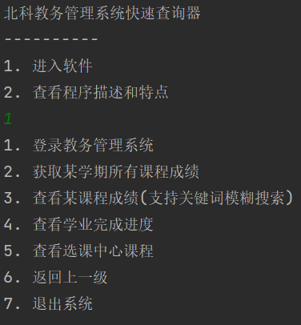

# JwglCrawl
北科新版教务管理系统,实现扫码全流程脱离浏览器,后续添加功能很方便

新版本的北科教务管理系统没法使用密码登录,只能通过 **微信扫码** 才可以登录, 本程序实现了 **微信认证** 的认证过程,并且最终得到session

得到session之后就可以实现爬取所用数据,只需要简单设计Xpath路径和数据处理代码就可以爬取任何数据,这里我只简单弄了一些功能:
1. 微信认证登录(非chromedriver,使用的requests库)
2. 查看某学习的所有课程成绩(输入学期)
3. 查看某门课程成绩(支持关键词的模糊搜索方式,只需要课程名关键词就行)
4. 查看目前我的学业完成进度

菜单尝试使用多级菜单完成,后续自动选课功能实现起来也不难,主要理清楚选课流程就行,之前写过一份代码,等有时间再整理



```
>> 查看某课程成绩(支持关键词模糊搜索)
>> 课程名称: 电机
|    序号    ||   开课学期   ||   课程编号   ||   课程名称   ||    成绩    ||    学分    ||   总学时    ||   补重学期   ||   考试性质   ||   课程性质   ||  通选课类别   ||   成绩类型   |
|    10    ||2022-2023-1|| 4230016  ||  电机及拖动   ||    xx    ||   2.5    ||    40    ||   正常考试   ||   专业核心   ||    主修    |
按回车继续
1. 登录教务管理系统
2. 获取某学期所有课程成绩
3. 查看某课程成绩(支持关键词模糊搜索)
4. 查看学业完成进度
5. 查看选课中心课程
6. 返回上一级
7. 退出系统
3
>> 查看某课程成绩(支持关键词模糊搜索)
>> 课程名称: 电路
|    序号    ||   开课学期   ||   课程编号   ||   课程名称   ||    成绩    ||    学分    ||   总学时    ||   补重学期   ||   考试性质   ||   课程性质   ||  通选课类别   ||   成绩类型   |
|    7     ||2021-2022-1|| xx ||电路分析基础AII ||    xx    ||   1.5    ||    24    ||   正常考试   ||   学科平台   ||    主修    |
|    序号    ||   开课学期   ||   课程编号   ||   课程名称   ||    成绩    ||    学分    ||   总学时    ||   补重学期   ||   考试性质   ||   课程性质   ||  通选课类别   ||   成绩类型   |
|    11    ||2020-2021-2|| xx || 电路分析基础AI ||    xx    ||    3     ||    48    ||   正常考试   ||   学科平台   ||    主修    |
按回车继续
```